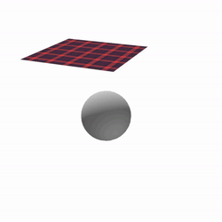
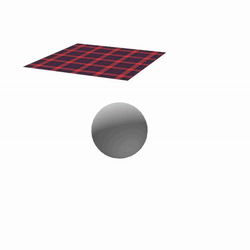

# Mass Spring Simulation

Implementation of mass-spring physics simulations (Finite Element Method) on Vulkan compute shaders.


https://github.com/user-attachments/assets/b1cf48f7-d806-493e-b96a-2a1c3ced82be


## Building

Requires the Vulkan SDK, CMake 3.10+, and a C++17 compiler.

```bash
cmake -B build
cmake --build build
```

Compile shaders separately:

```bash
./compile_shaders.sh
```

## Cloth Simulation

<div align="center">

| Friction Off | Friction On |
| :---: | :---: |
|  |  |

</div>


## Soft-body Simulation

<div align="center">


</div>

